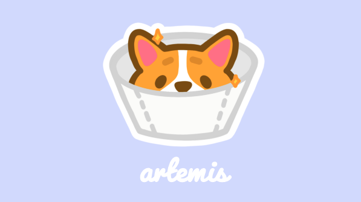

 

## Beta Stage

Team artemis will strive to continuously release updates and additional features.

1. If you would like to contribute to this project:

   - Please feel free to <a href="https://github.com/sophiapak/artemis/pulls">submit a PR</a>

2. If you happen to come across any issues while tinkering with the application:
   - Please <a href="https://github.com/sophiapak/artemis/issues">report the bug/issue</a> by submitting a ticket located in the Issues Tab within this repository

 

## Getting Started

1.  Clone artemis to your local machine and point to the artemis directory:

        git clone https://github.com/sophiapak/artemis.git

        cd artemis

2.  Install all required dependencies with the following script:

        npm install

3.  Run the following script to open artemis on http://localhost:8080:

        npm run dev

 

## Overview

artemis is an application that allows users to store and query client data.

Users can quickly query the data entering the Owner's Last Name and the Pet's Name.

If no matches are found, the application will return a message to the user saying that the client they are trying to find does not exist in the database.

Users also can add new clients to the database or add new pets to existing owners found in the database.

 

## Built With

- React
- Node.JS
  - Express
- PostgreSQL

 

## License

This project is licensed under the MIT License
